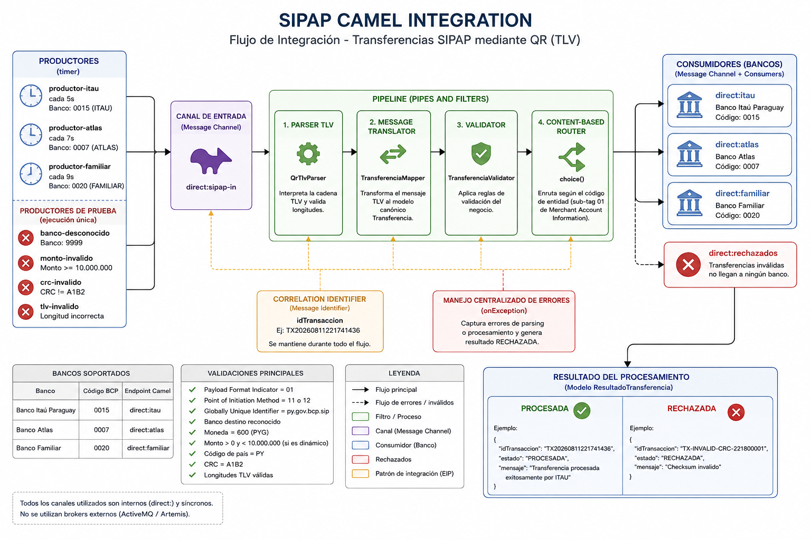
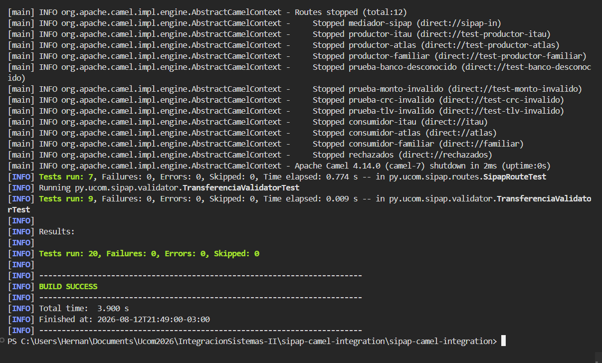
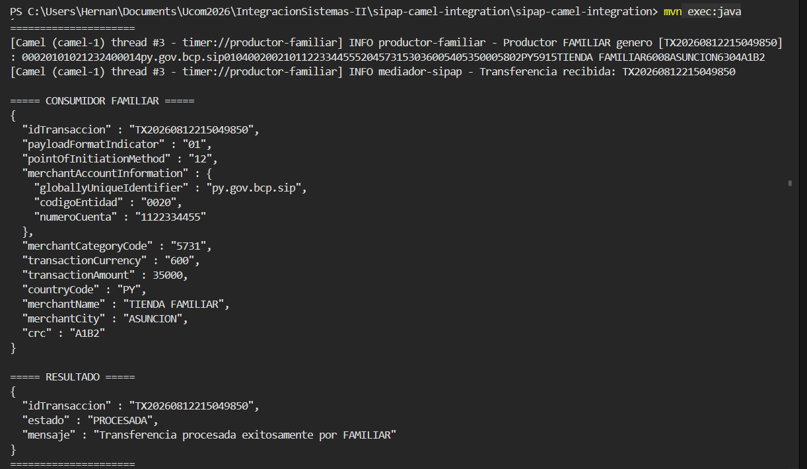
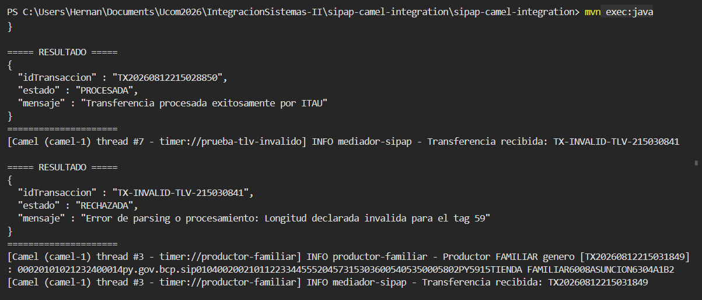

# SIPAP Camel Integration

Proyecto académico desarrollado con **Java 17**, **Maven** y **Apache Camel** para simular el procesamiento de transferencias SIPAP mediante cadenas QR con estructura **TLV (Tag-Length-Value)**.

La aplicación utiliza Apache Camel como mediador de integración para recibir transferencias simuladas, interpretar la información QR, validarla, transformarla a un modelo canónico y enrutarla al banco de destino correspondiente.

> **Importante:** este proyecto es exclusivamente educativo. No se conecta con bancos reales ni con la infraestructura real del SIP/SIPAP. El CRC utilizado (`A1B2`) es ficticio y se emplea únicamente para fines académicos.

---

## 1. Objetivo

Implementar un flujo de integración utilizando **Apache Camel** y patrones **Enterprise Integration Patterns (EIP)** que permita:

* generar transferencias QR simuladas;
* procesar cadenas TLV;
* interpretar campos anidados de `Merchant Account Information`;
* transformar el mensaje original a un modelo canónico;
* validar los datos recibidos;
* identificar el banco destino;
* enrutar las transferencias mediante endpoints internos `direct:`;
* rechazar transferencias inválidas;
* generar un resultado normalizado del procesamiento.

---

## 2. Tecnologías utilizadas

* Java 17
* Apache Maven 3.9+
* Apache Camel 4.14
* Camel Direct
* Camel Timer
* Jackson
* SLF4J
* JUnit 5
* Git
* GitHub
* Visual Studio Code

---

## 3. Arquitectura general

El flujo implementado sigue la siguiente estructura:

```text
Productores timer:
        |
        v
direct:sipap-in
        |
        v
Parser TLV
        |
        v
Message Translator
        |
        v
Modelo Transferencia
        |
        v
Validator
        |
        v
Content-Based Router
        |
   +----+---------+----------+
   |              |          |
   v              v          v
direct:itau   direct:atlas  direct:familiar
   |              |          |
   v              v          v
 ITAU           ATLAS      FAMILIAR
   \              |          /
    \             |         /
     +------------+--------+
                  |
                  v
        ResultadoTransferencia

Mensajes inválidos
        |
        v
direct:rechazados
        |
        v
Resultado RECHAZADA
```

Todos los canales utilizados son internos al mismo `CamelContext`.

No se utiliza ActiveMQ, Artemis ni ningún otro broker.

---
### Diagrama de arquitectura



## 4. Bancos simulados

La aplicación soporta los siguientes bancos:

| Banco               | Código BCP | Endpoint Camel    |
| ------------------- | ---------- | ----------------- |
| Banco Itaú Paraguay | `0015`     | `direct:itau`     |
| Banco Atlas         | `0007`     | `direct:atlas`    |
| Banco Familiar      | `0020`     | `direct:familiar` |

El código de entidad se obtiene desde el sub-tag `01` de `Merchant Account Information`.

---

## 5. Formato QR utilizado

La transferencia se representa mediante una estructura TLV simplificada:

```text
TAG + LONGITUD + VALOR
```

Ejemplo:

```text
000201
```

se interpreta como:

```text
00 | 02 | 01
```

donde:

* `00` = Tag
* `02` = longitud
* `01` = valor

---

## 6. Campos principales

Los principales tags utilizados son:

| Tag  | Descripción                  |
| ---- | ---------------------------- |
| `00` | Payload Format Indicator     |
| `01` | Point of Initiation Method   |
| `32` | Merchant Account Information |
| `52` | Merchant Category Code       |
| `53` | Transaction Currency         |
| `54` | Transaction Amount           |
| `58` | Country Code                 |
| `59` | Merchant Name                |
| `60` | Merchant City                |
| `63` | CRC                          |

---

## 7. Merchant Account Information

El tag `32` funciona como un contenedor TLV y contiene información adicional necesaria para identificar el destino de la transferencia.

Ejemplo conceptual:

```text
32
 |
 +-- 00 -> py.gov.bcp.sip
 |
 +-- 01 -> 0015
 |
 +-- 02 -> 1234567890
```

Los sub-tags implementados son:

| Sub-tag | Campo                      | Ejemplo          |
| ------- | -------------------------- | ---------------- |
| `00`    | Globally Unique Identifier | `py.gov.bcp.sip` |
| `01`    | Código de entidad bancaria | `0015`           |
| `02`    | Número de cuenta           | `1234567890`     |

El parser procesa nuevamente el contenido del tag `32` para obtener estos valores.

---

## 8. Modelo canónico

Después de interpretar la cadena TLV, el mediador transforma el mensaje a un objeto `Transferencia`.

Ejemplo:

```json
{
  "idTransaccion": "TX20260811221741436",
  "payloadFormatIndicator": "01",
  "pointOfInitiationMethod": "12",
  "merchantAccountInformation": {
    "globallyUniqueIdentifier": "py.gov.bcp.sip",
    "codigoEntidad": "0015",
    "numeroCuenta": "1234567890"
  },
  "merchantCategoryCode": "5731",
  "transactionCurrency": "600",
  "transactionAmount": 15000,
  "countryCode": "PY",
  "merchantName": "TIENDA ITAU",
  "merchantCity": "ASUNCION",
  "crc": "A1B2"
}
```

Los consumidores bancarios trabajan exclusivamente con este modelo y no necesitan interpretar nuevamente la cadena TLV original.

---

## 9. Validaciones implementadas

Antes de enviar una transferencia al consumidor bancario correspondiente se realizan las siguientes validaciones:

* `Payload Format Indicator` debe ser `01`.
* `Point of Initiation Method` debe ser `11` o `12`.
* `Merchant Account Information` debe existir.
* `Globally Unique Identifier` debe ser `py.gov.bcp.sip`.
* debe existir un código de entidad.
* el banco debe ser reconocido.
* debe existir un número de cuenta.
* la moneda debe ser `600`, correspondiente a PYG.
* para QR dinámico (`12`), el monto es obligatorio.
* el monto debe ser mayor a cero.
* el monto debe ser menor a `10.000.000`.
* el código de país debe ser `PY`.
* el CRC debe ser `A1B2`.
* las longitudes TLV declaradas deben ser válidas.

Si alguna validación falla, la transferencia no llega a ningún consumidor bancario.

---

## 10. Resultado del procesamiento

Todas las transferencias producen un resultado común.

### Transferencia procesada

```json
{
  "idTransaccion": "TX20260811221741436",
  "estado": "PROCESADA",
  "mensaje": "Transferencia procesada exitosamente por ITAU"
}
```

### Transferencia rechazada

```json
{
  "idTransaccion": "TX-INVALID-CRC-221800001",
  "estado": "RECHAZADA",
  "mensaje": "Checksum invalido"
}
```

---

## 11. Patrones EIP implementados

### Message Channel

Los endpoints `direct:` representan canales internos síncronos entre las rutas Apache Camel.

Ejemplos:

```text
direct:sipap-in
direct:itau
direct:atlas
direct:familiar
direct:rechazados
```

---

### Pipes and Filters

El procesamiento está dividido en diferentes etapas:

```text
Recepción
   ↓
Parsing
   ↓
Transformación
   ↓
Validación
   ↓
Enrutamiento
   ↓
Procesamiento
```

Cada etapa tiene una responsabilidad específica.

---

### Message Translator

La cadena QR original en formato TLV se transforma a un modelo canónico Java:

```text
QR TLV
   ↓
QrTlvParser
   ↓
TransferenciaMapper
   ↓
Transferencia
```

De esta forma los consumidores bancarios quedan desacoplados del formato QR original.

---

### Content-Based Router

Apache Camel utiliza `choice()` para seleccionar el banco destino según `codigoEntidad`.

Conceptualmente:

```text
0015 -> ITAU
0007 -> ATLAS
0020 -> FAMILIAR
```

---

### Message Filter

Una transferencia inválida es detenida antes de llegar al consumidor bancario.

```text
Transferencia
     |
     v
Validación
  /      \
válida   inválida
  |         |
Banco    Rechazados
```

---

### Correlation Identifier

Cada transferencia recibe un identificador:

```text
idTransaccion
```

Ejemplo:

```text
TX20260811221741436
```

El identificador se mantiene durante todo el flujo de procesamiento.

---

### Manejo centralizado de errores

Apache Camel utiliza `onException()` para capturar errores de parsing o procesamiento.

Por ejemplo, una cadena TLV cuya longitud declarada sea incorrecta genera un resultado:

```json
{
  "estado": "RECHAZADA",
  "mensaje": "Error de parsing o procesamiento: ..."
}
```

---

## 12. Estructura del proyecto

```text
sipap-camel-integration/
│
├── pom.xml
├── README.md
├── .gitignore
│
└── src/
    ├── main/
    │   └── java/
    │       └── py/
    │           └── ucom/
    │               └── sipap/
    │                   │
    │                   ├── App.java
    │                   │
    │                   ├── generator/
    │                   │   └── QrGenerator.java
    │                   │
    │                   ├── model/
    │                   │   ├── MerchantAccountInformation.java
    │                   │   ├── Transferencia.java
    │                   │   └── ResultadoTransferencia.java
    │                   │
    │                   ├── parser/
    │                   │   ├── QrTlvParser.java
    │                   │   └── TransferenciaMapper.java
    │                   │
    │                   ├── routes/
    │                   │   └── SipapRoute.java
    │                   │
    │                   └── validator/
    │                       └── TransferenciaValidator.java
    │
    └── test/
        └── java/
```

---

## 13. Requisitos previos

Para ejecutar el proyecto se necesita:

### Java

```bash
java -version
```

Versión utilizada durante el desarrollo:

```text
OpenJDK 17
```

### Maven

```bash
mvn -version
```

Versión utilizada durante el desarrollo:

```text
Apache Maven 3.9.x
```

---

## 14. Instalación

Clonar el repositorio:

```bash
git clone https://github.com/hernansilgueira-ccp/sipap-camel-integration.git
```

Ingresar al directorio:

```bash
cd sipap-camel-integration
```

Compilar:

```bash
mvn clean compile
```

Si todo está correctamente configurado se deberá obtener:

```text
BUILD SUCCESS
```

---

## 15. Ejecución

Ejecutar:

```bash
mvn exec:java
```

La aplicación iniciará Apache Camel y comenzará a generar transferencias simuladas utilizando endpoints `timer:`.

Para detener la aplicación:

```text
CTRL + C
```

---

## 16. Productores simulados

Se implementan productores periódicos utilizando el componente `timer:`.

Ejemplos:

```text
timer:productor-itau
timer:productor-atlas
timer:productor-familiar
```

Cada productor genera una cadena QR TLV que posteriormente es enviada a:

```text
direct:sipap-in
```

---

## 17. Escenarios de prueba

El proyecto contempla los siguientes escenarios requeridos:

| # | Escenario                        | Resultado esperado |
| - | -------------------------------- | ------------------ |
| 1 | Transferencia válida a ITAU      | PROCESADA          |
| 2 | Transferencia válida a ATLAS     | PROCESADA          |
| 3 | Transferencia válida a FAMILIAR  | PROCESADA          |
| 4 | Banco destino desconocido        | RECHAZADA          |
| 5 | TLV con longitud incorrecta      | RECHAZADA          |
| 6 | Monto mayor o igual a 10.000.000 | RECHAZADA          |
| 7 | CRC diferente de A1B2            | RECHAZADA          |

---

## 18. Ejemplos de mensajes válidos

### ITAU

```text
codigo_entidad = 0015
numero_cuenta = 1234567890
monto = 15000
moneda = 600
crc = A1B2
```

### ATLAS

```text
codigo_entidad = 0007
numero_cuenta = 9876543210
monto = 25000
moneda = 600
crc = A1B2
```

### FAMILIAR

```text
codigo_entidad = 0020
numero_cuenta = 1122334455
monto = 35000
moneda = 600
crc = A1B2
```

---

## 19. Ejemplos de mensajes inválidos

### Banco desconocido

```text
codigo_entidad = 9999
```

Resultado esperado:

```text
RECHAZADA
Banco destino desconocido: 9999
```

### Monto inválido

```text
transaction_amount = 10000000
```

Resultado esperado:

```text
RECHAZADA
El monto supera o iguala el maximo permitido
```

### CRC inválido

```text
crc = FFFF
```

Resultado esperado:

```text
RECHAZADA
Checksum invalido
```

### TLV inválido

Una longitud declarada que no coincide con el tamaño real del valor provoca un error de parsing.

Resultado esperado:

```text
RECHAZADA
Error de parsing o procesamiento
```

---

## 20. Componentes principales

### `App.java`

Responsable de:

* crear el `CamelContext`;
* registrar las rutas;
* iniciar Apache Camel.

### `SipapRoute.java`

Contiene el flujo principal de integración:

* productores;
* recepción;
* transformación;
* validación;
* enrutamiento;
* consumidores;
* manejo de rechazados.

### `QrGenerator.java`

Genera cadenas TLV válidas e inválidas utilizadas en las pruebas.

### `QrTlvParser.java`

Interpreta estructuras:

```text
TAG + LONGITUD + VALOR
```

y verifica que las longitudes declaradas sean válidas.

### `TransferenciaMapper.java`

Convierte la estructura TLV al modelo canónico `Transferencia`.

También interpreta el TLV anidado contenido dentro de `Merchant Account Information`.

### `TransferenciaValidator.java`

Aplica las reglas de validación antes del enrutamiento.

### `Transferencia.java`

Modelo canónico interno utilizado por el mediador y los consumidores.

### `ResultadoTransferencia.java`

Representa el resultado final:

```text
PROCESADA
```

o:

```text
RECHAZADA
```

---

## Evidencias de ejecución

El proyecto fue validado mediante pruebas unitarias, pruebas de integración de Apache Camel y ejecución funcional completa.

### Pruebas automatizadas

La ejecución final se realizó mediante:

```bash
mvn clean test
```

Resultado obtenido:

```text
Tests run: 20
Failures: 0
Errors: 0
Skipped: 0

BUILD SUCCESS
```

Dentro de estas pruebas, `SipapRouteTest` ejecuta los 7 escenarios principales de integración requeridos:

1. Transferencia válida a ITAU.
2. Transferencia válida a ATLAS.
3. Transferencia válida a FAMILIAR.
4. Banco destino desconocido.
5. Monto mayor o igual a 10.000.000 PYG.
6. CRC diferente de `A1B2`.
7. TLV con longitud declarada incorrecta.



---

### Transferencia procesada correctamente

La siguiente evidencia muestra una transferencia destinada a Banco Familiar.

El mediador interpreta el QR, genera el modelo canónico, identifica el código de entidad `0020` y enruta el mensaje al consumidor correspondiente.

El resultado obtenido es:

```json
{
  "estado": "PROCESADA",
  "mensaje": "Transferencia procesada exitosamente por FAMILIAR"
}
```


---

### Transferencia rechazada

La siguiente evidencia corresponde a una cadena TLV inválida.

La longitud declarada para el tag `59` no coincide con la cantidad de caracteres disponibles. El error es capturado por el manejo centralizado de excepciones de Apache Camel.

El resultado es:

```text
estado: RECHAZADA
mensaje: Error de parsing o procesamiento:
         Longitud declarada invalida para el tag 59
```



Esta prueba demuestra que un mensaje inválido es rechazado sin detener el funcionamiento general del mediador.

---

## Ejemplos de QR

Los ejemplos utilizados para las transferencias válidas e inválidas se encuentran en:

```text
docs/ejemplos-qr.txt
```

El archivo incluye ejemplos correspondientes a:

- ITAU (`0015`);
- ATLAS (`0007`);
- FAMILIAR (`0020`);
- banco desconocido;
- monto inválido;
- CRC inválido;
- longitud TLV inválida.

---

## 21. Restricciones de la implementación

La solución:

* no utiliza ActiveMQ;
* no utiliza Artemis;
* no utiliza ningún broker externo;
* no utiliza XML como formato de transferencia;
* utiliza exclusivamente `direct:` como canal interno;
* utiliza comunicación síncrona;
* no posee persistencia de mensajes;
* no se conecta con bancos reales;
* no se conecta con infraestructura SIPAP real;
* utiliza `A1B2` como CRC didáctico.

---

## 22. Consideraciones

Los endpoints `direct:` funcionan dentro del mismo proceso Java y del mismo `CamelContext`.

Esto significa que:

* son síncronos;
* no almacenan mensajes;
* no garantizan persistencia;
* los mensajes se pierden si el proceso se detiene.

En una evolución futura podrían ser reemplazados por un sistema de mensajería persistente sin necesidad de modificar el parser, el modelo canónico o las reglas de negocio.

---

## 23. Repositorio

Proyecto disponible en:

```text
https://github.com/hernansilgueira-ccp/sipap-camel-integration
```

---

## 24. Uso académico

Proyecto realizado con fines educativos para la implementación de flujos de integración utilizando **Apache Camel**, patrones **Enterprise Integration Patterns**, transformación de mensajes y simulación de transferencias SIP mediante estructuras QR/TLV.

La información procesada es completamente ficticia y no debe utilizarse para realizar operaciones financieras reales.
